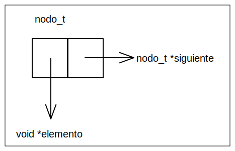
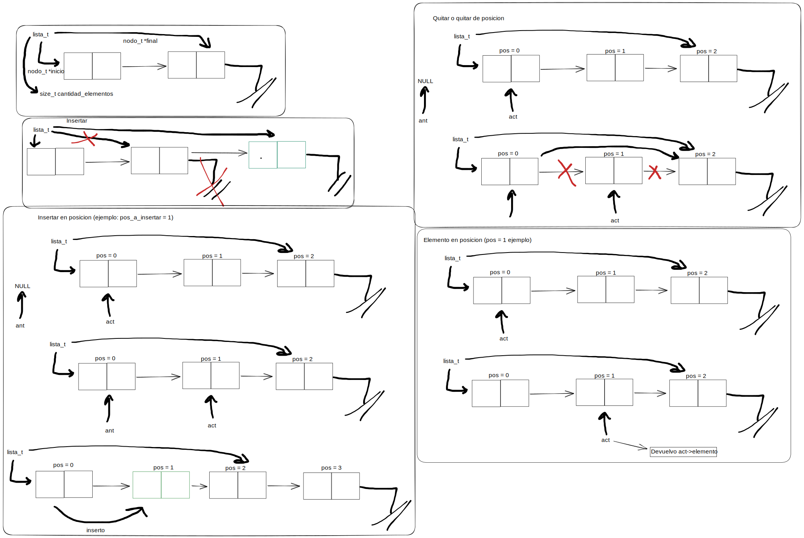
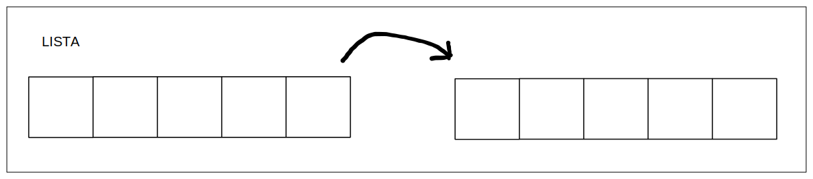

<div align="right">

</div>

# TDA LISTA/PILA/COLA

## Repositorio de Valentin Calomino - 109665 - vcalomino@fi.uba.ar

- Para compilar:

```bash
gcc -std=c99 -Wall -Wconversion -Wtype-limits -pedantic -Werror -O2 -g src/*.c pruebas_chanutron.o -o pruebas_chanutron

gcc -std=c99 -Wall -Wconversion -Wtype-limits -pedantic -Werror -O2 -g src/*.c pruebas_alumno.c -o pruebas_alumno
```

- Para ejecutar:

```bash
./pruebas_chanutron

./pruebas_alumno
```

- Para ejecutar con valgrind:
```bash
valgrind ./pruebas_chanutron

valgrind ./pruebas_alumno
```
---
##  Funcionamiento

Se utiliza la funcion "calloc" en vez de "malloc", ya que devuelve la estructura inicializada en 0.

### Estructura nodo:


### Operaciones y estructura lista:
   

Quitar elemento al final o en una posicion particular son operaciones similares, ya que hay que recorrer hasta encontrar el final de la lista o la posicion particular.

Las operaciones lista_primero y lista_ultimo unicamente devuelven el elemento del primer y ultimo nodo de la lista.

Por ultimo, las operaciones de lista_tamanio y lista_vacia, se basan en la variable cantidad_elementos que utilice en mi implementacion.

---

## Respuestas a las preguntas teóricas
Una lista es un conjunto ordenado de elementos.


Una pila es una estructura en la que el ultimo elemento que entra es el proximo elemento que sale.


Por ultimo, una cola es una estructura en la que el primer elemento que entra es el primero en salir.


---

Implementacion lista simplemente enlazada:

Las operaciones de insertar, obtener y eliminar al inicio son O(1). En insertar hay que crear un nuevo nodo, hacer que el siguiente de ese nodo sea el inicio de la lista y cambiar el inicio de la lista a ese nuevo nodo.
En obtener, simplemente hay que devolver el elemento que contiene el nodo al que apunta el inicio de la lista.
Y en eliminar, tengo que cambiar el inicio de la lista al siguiente nodo del inicio y liberar la memoria de ese elemento que elimino.

A la vez, si tengo una referencia al nodo final, realizar las operaciones de obtener e insertar son similares al caso del inicio. Sin embargo, insertar al final es una operacion O(n) ya que necesito encontrar el penultimo nodo para cambiar su siguiente a NULL, cambiar la referencia de nodo final a este y luego liberar la memoria del nodo que eliminamos.

Por ultimo, estas operaciones realizadas en la mitad de la lista son todas O(n) ya que tengo que recorrer la lista llevando un contador para encontrar el elemento que quiero sacar/obtener, o encontrar la posicion en la que quiero insertar.

---

Implementaciones lista doblemente enlazada:

En esta estructura los nodos llevan una referencia a su anterior, ademas de la que llevan al siguiente. Sin embargo, la unica operacion que cambia respecto de la lista simplemente enlazada es eliminar al final, que es O(1), ya que el nodo final tiene una referencia al nodo anterior, que es el penultimo. Por tanto solo hay que reapuntar, los punteros y liberar igualmente el nodo que quitamos.

---

Implementaciones vector dinámico:

Las operaciones eliminar e insertar al inicio son O(n) ya que si insertas, luego se deben desplazar todos los elementos hacia la derecha y en el caso de eliminar hacia la izquierda.
Obtener al inicio es O(1) porque no se realiza ningun desplazamiento.

Insertar al final, excepto en el caso que necesitemos mas espacio (realloc), es O(1) ya que tampoco se necesitan desplazamientos. Un caso parecido es el de la eliminacion al final, que si no debemos reducir el tamaño del vector, tambien es O(1). Por ultimo, obtener el elemento final con el operador "[ ]" tambien es O(1).

Finalmente, las operaciones de insertar/eliminar en el medio son O(n) ya que se debe recorrer el vector insertar/eliminar y luego mover los elementos hacia la derecha/izquierda segun corresponda.
Nuevamente, obtener con "[ ]" es una operacion O(1).

---

Se reutilizo la estructura de la lista simplemente enlazada para las estructuras de cola y pila en el TP, haciendo que sus operaciones sean O(1).

Operaciones pila:

Apilar y desapilar: se inserta o elimina al principio de la lista, lo que simula el funcionamiento de una pila (first in, last out). Como dijimos en el punto anterior, con esta implementacion insertar y eliminar al principio son operaciones O(1).

A su vez, ver tope es de tiempo constante, porque unicamente hay que obtener el primer nodo, al que se tiene una referencia.

Operaciones cola:

Encolar y desencolar: Para encolar se inserta al final de la lista lo que tiene complejidad O(1) y se elimina al principio igual que en la pila. La cola sigue el principio "first in, first out" es decir, el primer elemento que inserto es el primero que se elimina cuando desencolo.

Por ultimo, para ver el frente nuevamente solo debo obtener el primer nodo, que es una operacion O(1).
